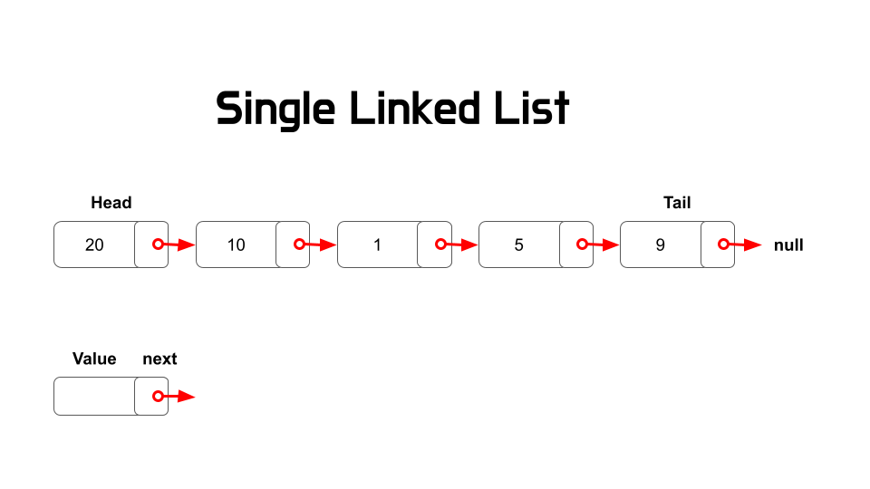
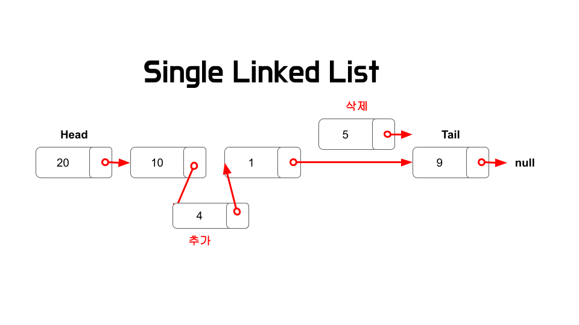
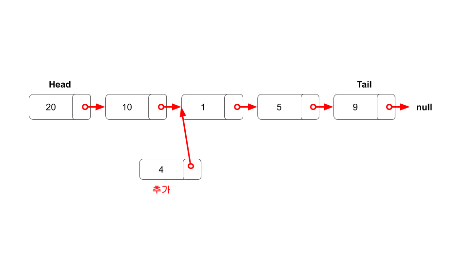
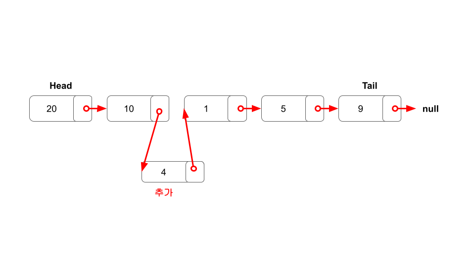
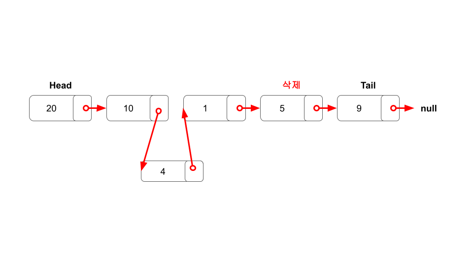
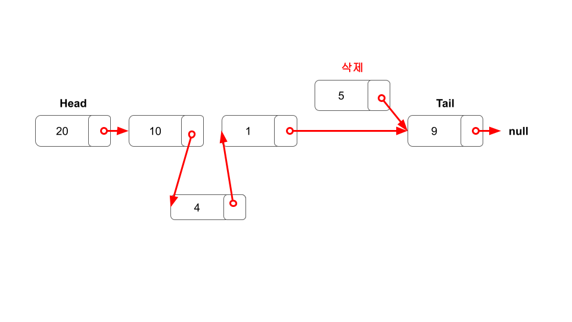
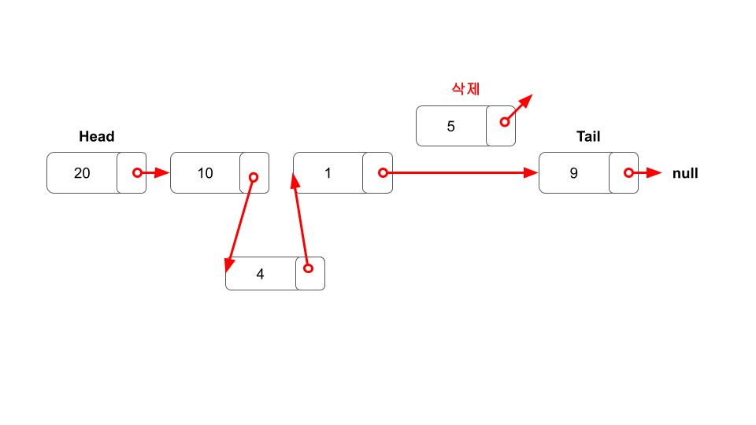

## **연결 리스트 Linked List**

<br/>
연결 리스트는 여러 노드들이 순차적으로 연결된 형태를 갖는 자료구조이다.
<br/>
첫 노드인 Head와 마지막 노드인 Tail 사이에서 각 노드는 데이터와 다음 노드를 가리키는 포인터로 구성되어 있다.
<br/>
종종 배열과 비교되기도 하는데 각 자료 구조의 특징은 다음과 같다.

<br/>

|      |                           배열                            |                   연결 리스트                    |
| :--: | :-------------------------------------------------------: | :----------------------------------------------: |
| 장점 |                  인덱스를 통한 빠른 접근                  |                삽입과 삭제가 용이                |
| 단점 |    삽입과 삭제 <br/> 중간 데이터 삭제시 공간 낭비 발생    |          임의 접근이 불가능해 느린 탐색          |
| 용도 | 빠른 접근이 요구되고,<br/> 데이터의 삽입과 삭제가 적을 때 | 삽입과 삭제 연산이 요구되고,<br/> 검색이 적을 때 |
|      |                                                           |                                                  |

<br/>

## **단일 연결 리스트**

<br/>



단일 연결 리스트는 각 노드가 다음 노드를 가리키며 한 방향으로 연결되어 있는 자료 구조이다.

<br/>



연결 관계를 지속하는 것에 주의하면 데이터 추가와 삭제가 어렵지 않다.

<br/>

### **추가**




새로운 노드를 생성하고, 새 노드가 그 다음 노드를 가리키게 한다.  
새 노드의 이전 노드가 새 노드를 가리키게 한다.

<br/>

### **삭제**





삭제할 타겟 노드를 찾는다.  
타겟 노드의 이전 노드가 타겟 노드가 가리키던 노드를 가리키게 한다.  
타겟 노드의 포인터가 아무것도 가리키지 않게 한다.

<br/>

### **구현**

<details>
<summary>코드 보기</summary>

```javascript
class Node {
  constructor(val) {
    this.val = val;
    this.next = null;
  }
}

class SinglyLinkedList {
  constructor() {
    this.head = null;
    this.tail = null;
    this.length = null;
  }

  push(val) {
    let newNode = new Node(val);
    if (!this.head) {
      this.head = newNode;
      this.tail = this.head;
    } else {
      this.tail.next = newNode;
      this.tail = newNode;
    }
    this.length++;
    return this;
  }

  pop() {
    if (!this.head) return undefined;
    var current = this.head;
    var newTail = current;
    while (current.next) {
      newTail = current;
      current = current.next;
    }
    this.tail = newTail;
    this.tail.next = null;
    this.length--;
    if (this.length === 0) {
      this.head = null;
      this.tail = null;
    }
    return current;
  }

  shift() {
    if (!this.head) return undefined;
    let currentHead = this.head;
    this.head = currentHead.next;
    this.length--;
    return currentHead;
  }

  unshift(val) {
    let newNode = new Node(val);
    if (!this.head) {
      this.head = newNode;
      this.tail = this.head;
    } else {
      newNode.next = this.head;
      this.head = newNode;
    }
    this.length++;
    return this;
  }

  get(index) {
    if (index < 0 || index >= this.length) return null;
    let counter = 0;
    let current = this.head;
    while (counter !== index) {
      current = current.next;
      counter++;
    }
    return current;
  }

  set(val, index) {
    let foundNode = this.get(index);
    if (foundNode) {
      foundNode.val = val;
      return true;
    }
    return false;
  }

  insert(index, val) {
    if (index < 0 || index > this.length) return false;
    if (index === this.length) return !!this.push(val);
    if (index === 0) return !!this.unshift(val);
    let newNode = new Node(val);
    let prev = this.get(index - 1);
    let temp = prev.next;
    prev.next = newNode;
    newNode.next = temp;
    this.length++;
    return true;
  }

  remove(index) {
    if (index < 0 || index >= this.length) return undefined;
    if (index === 0) return this.shift();
    if (index === this.length - 1) return this.pop();
    let previousNode = this.get(index - 1);
    let removed = previousNode.next;
    previousNode.next = removed.next;
    this.length--;
    return removed;
  }

  reverse() {
    let node = this.head;
    this.head = this.tail;
    this.tail = node;
    let next;
    let prev = null;
    for (let i = 0; i < this.length; i++) {
      next = node.next;
      node.next = prev;
      prev = node;
      node = next;
    }
    return this;
  }
}
```

</details>

```toc

```
