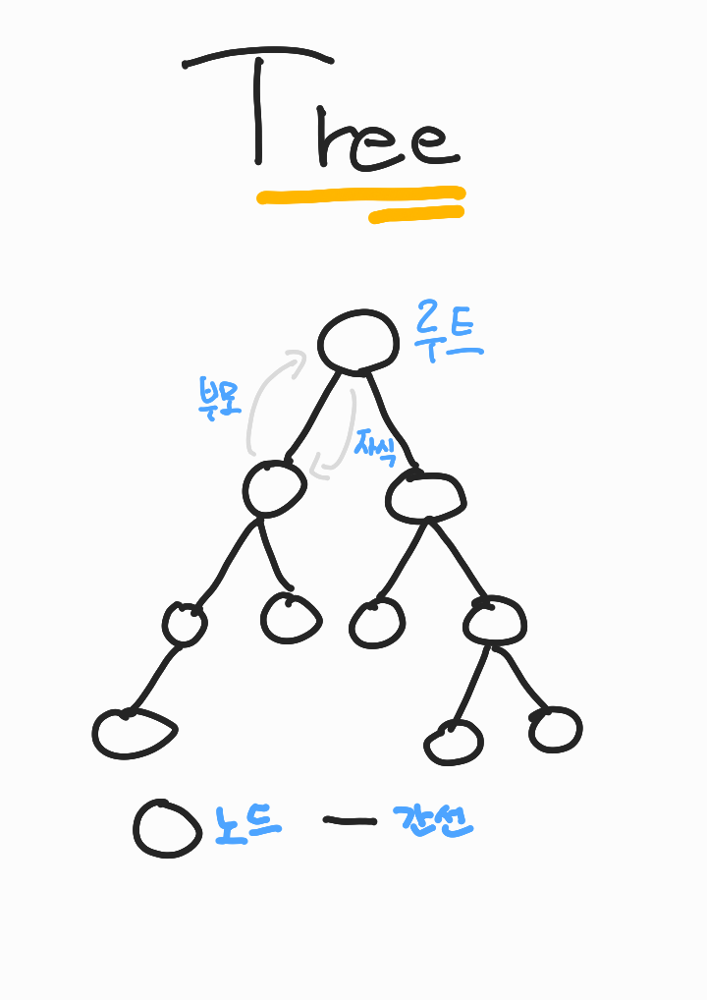
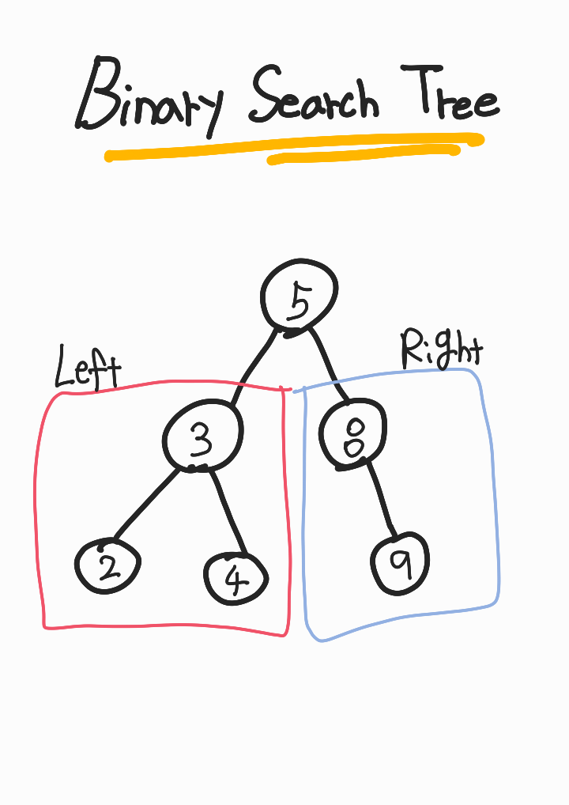
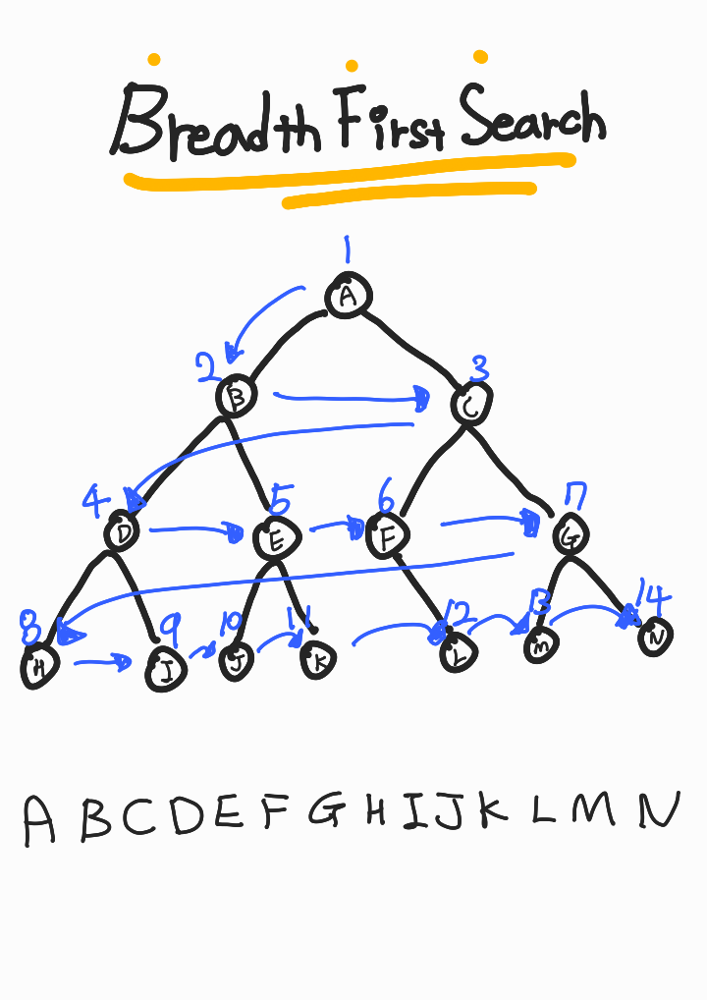
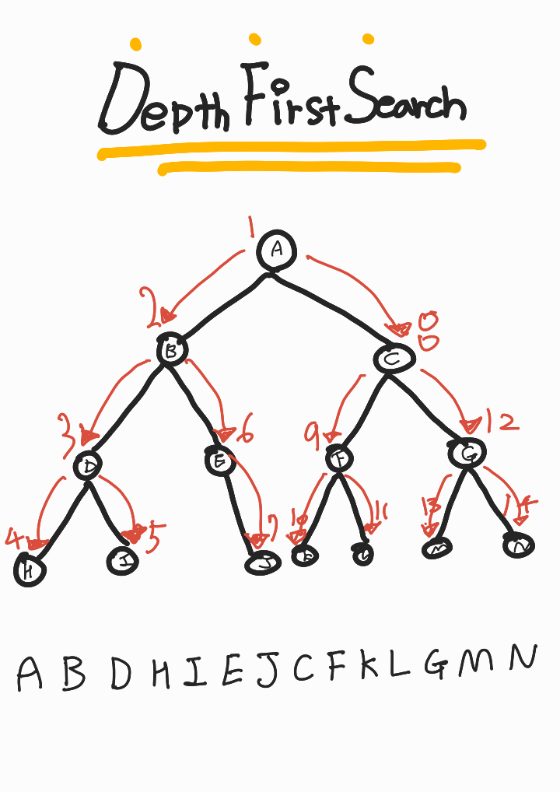

## **트리 Tree**

<div align="center">
    
</div>

### **특징**

트리는 노드와 간선으로 이루어진 데이터 구조를 의미한다.

그림과 같이 하나의 뿌리(루트)부터 시작해 간선으로 연결된 여러 갈래의 노드 가지가 뻗어있는 구조이다.

두 노드가 상하 관계를 갖고 있을때, 서로 부모-자식 관계라 하며, 루트에서 가까운 노드를 부모 노드, 먼 쪽을 자식 노드라고 한다.

---

## **이진 탐색 트리 Binary Search Tree**

<div align="center">
    
</div>

### **특징**

이진 탐색 트리는 부모 노드가 특정 기준에 의해 최대 2개의 자식 노드를 갖는 특징을 보이는 트리다.

노드의 정렬이 특정 순서로 되어있어 탐색하기 쉽다.

그림은 왼쪽 자식 노드가 부모보다 작고 오른쪽 자식 노드가 부모보다 큰 기준에 의해 분류되어있다.

부모 노드를 확인하고 조건에 맞는 한쪽 노드를 확인하기에 탐색을 절반으로 줄일 수 있다.

한쪽으로 쏠려있는 트리가 될 수 있기에 기준점이 되는 루트를 잘 정하는게 중요하다.

<br/>

---

<br/>

## **트리 순회**

트리를 순회하는 여러가지 방법이 있지만, BFS와 DFS가 가장 유명하고 널리 쓰인다.

### **BFS - Breadth First Search**

<div align="center">
    
</div>

너비 우선 탐색은 트리를 한 층씩 확인하는 방법이다.

그림과 같이 부모 노드부터 가장 마지막 자식 노드(Leaf 노드)까지 층층이 확인한다.

<br/>

### **DFS - Deep First Search**

<div align="center">
    
</div>

깊이 우선 탐색은 트리의 한쪽 마지막 자식 노드(Leaf 노드)를 확인한 후 순차적으로 반대쪽 끝까지 마지막 자식 노드를 확인하는 방법이다.

그림과 같이 한방향으로 도달할 수 있는 마지막 노드를 확인하고 반대쪽 끝까지 같은 방법으로 노드를 확인한다.

방법에 따라 3가지로 구분할 수 있다.

1. **전위 탐색** - root > 왼쪽 > 오른쪽 => A BDHIBJ CFKLGMN
2. **중위 탐색** - 왼쪽 > root > 오른쪽 => BDHIBJ A CFKLGMN
3. **후위 탐색** - 왼쪽 > 오른쪽 > root => BDHIBJ CFKLGMN A

```toc

```
