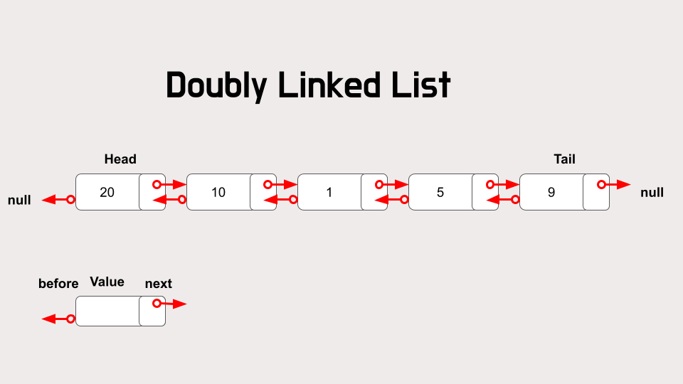
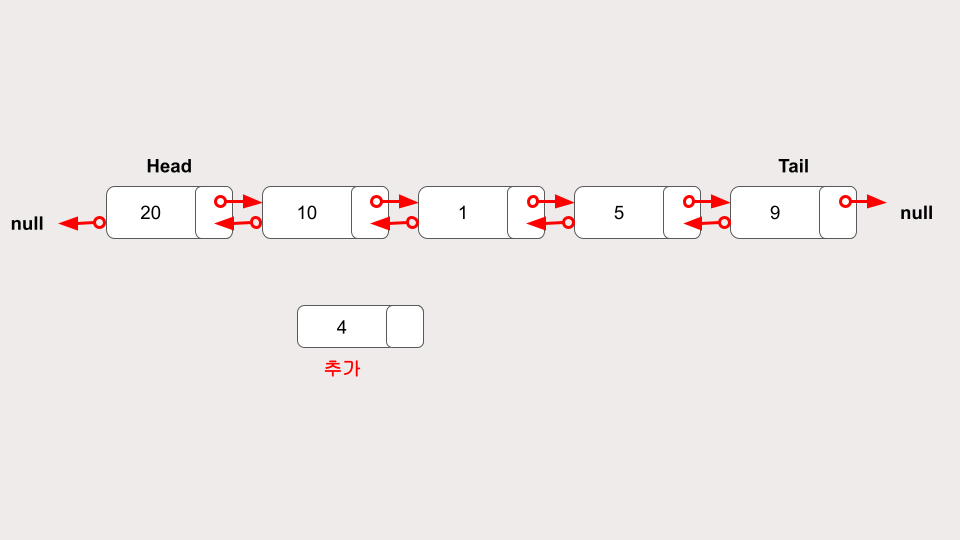
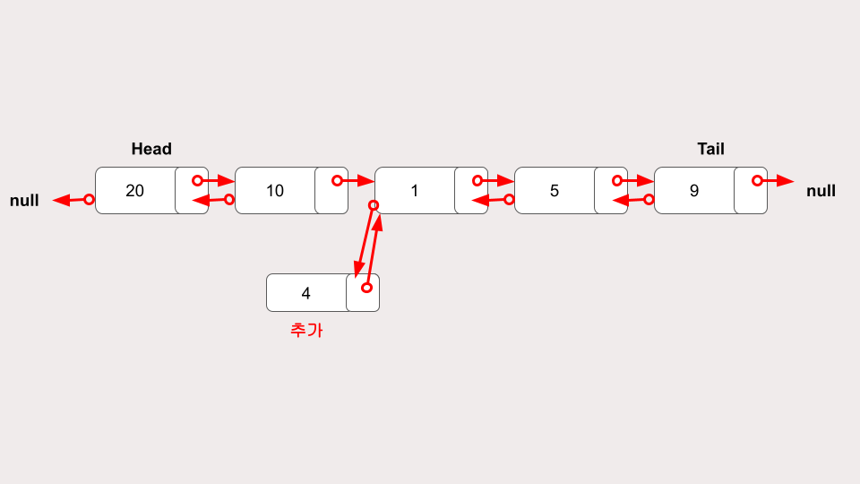
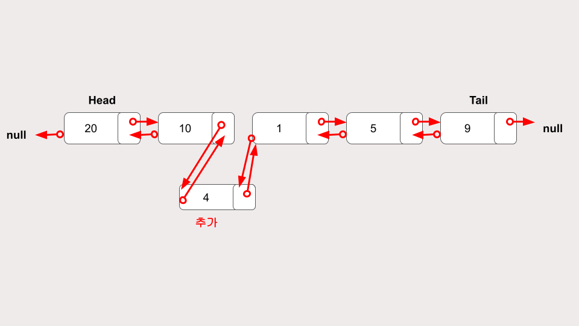
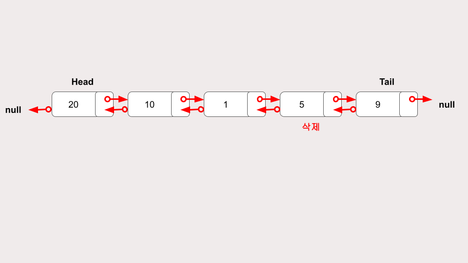
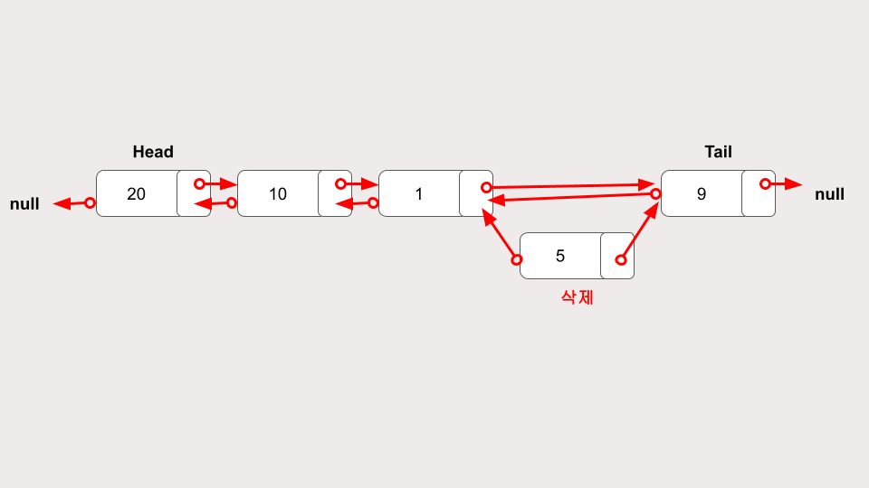
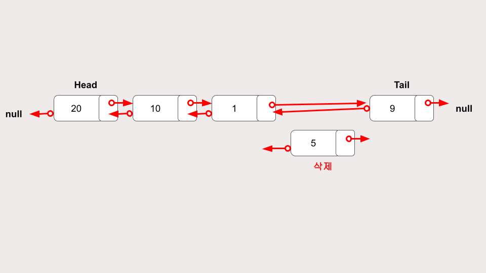

## **이중 연결 리스트**

---



### **특징**

이중 연결 리스트는 단일 연결 리스트에 반대 방향으로 연결이 하나 추가된 개념이다. 단일 연결 리스트는 다음 노드만 연결했다면, 이중 연결 리스트는 이전 노드까지 연결한다.

그렇기에 양방향에서 탐색이 가능하다.

[ 20 ➡ 10 ➡ 1 ➡ 5 ➡ 9 ]  
[ 20 ⬅ 10 ⬅ 1 ⬅ 5 ⬅ 9 ]

양방향 탐색은 특정 인덱스의 데이터를 가져오거나 노드를 탐색할 때 큰 장점이 된다.

<br/>

### **단점**

하지만 연결을 한 번 더 해야하기에 단일 연결 리스트보다 메모리 소모가 크다.  
그리고 구현이 조금 더 복잡해진다.

그렇다해도 장점이 더 크기에 단일 연결 리스트보다는 이중 연결 리스트를 사용한다.

<br/>

### **추가**

단일 연결 리스트와 비슷하다.  
이전 노드와의 연결만 추가하면 된다.





### **삭제**

단일 연결 리스트와 비슷하다.  
이전 노드와의 연결만 해제하면 된다.





<br/>

### **구현**

<details>
<summary>코드 보기</summary>

```javascript
class Node {
  constructor(val) {
    this.val = val;
    this.next = null;
    this.prev = null;
  }
}

class DoublyLinkedList {
  constructor() {
    this.head = null;
    this.tail = null;
    this.length = 0;
  }

  // 마지막에 요소 추가
  push(val) {
    // 노드 만들기
    let newNode = new Node(val);

    // 비어있는지 확인
    if (this.length === 0) {
      this.head = newNode;
      this.tail = newNode;
    } else {
      // 추가한 요소가 마지막 노드가 되도록 설정
      // prev, next 연결
      this.tail.next = newNode;
      newNode.prev = this.tail;
      this.tail = newNode;
    }
    this.length++;
    return this;
  }

  // 마지막 요소 삭제
  pop() {
    // 비어있는지 확인
    if (!this.head) return undefined;
    // 직전 노드가 마지막 요소가 되도록 설정
    let poppedNode = this.tail;
    if (this.length === 1) {
      this.head = null;
      this.tail = null;
    } else {
      this.tail = poppedNode.prev;
      this.tail.next = null;
      // 삭제할 노드의 연결 끊기
      poppedNode.prev = null;
    }
    this.length--;
    return poppedNode;
  }

  // 앞 요소 삭제
  shift() {
    // 비어있는지 확인
    if (this.length === 0) return undefined;
    // 삭제할 노드의 연결 끊기
    let oldHead = this.head;
    // 요소가 한개일 경우
    if (this.length === 1) {
      this.head = null;
      this.tail = null;
    } else {
      // 2번 요소가 head 역할하게
      this.head = oldHead.next;
      this.head.prev = null;
      oldHead.next = null;
    }
    this.length--;
    return oldHead;
  }

  // 앞 요소 추가
  unshift(val) {
    let newNode = new Node(val);
    // 비어있는지 확인
    if (this.length === 0) {
      this.head = newNode;
      this.tail = newNode;
    } else {
      // 새 노드 연결
      this.head.prev = newNode;
      newNode.next = this.head;
      this.head = newNode;
    }
    this.length++;
    return this;
  }

  // 인덱스에 해당하는 값 가져오기
  get(index) {
    // 인덱스가 유효한지 확인하기
    if (index < 0 || index >= this.length) return null;
    // 인덱스가 가까운 위치 확인하기 (앞/뒤)
    let count = 0;
    if (index <= this.length / 2) {
      // 앞부터찾기 인덱스에 해당하는 값 가져오기
      let current = this.head;
      while (count !== index) {
        current = current.next;
        count++;
      }
      return current;
    } else {
      // 뒤부터찾기 인덱스에 해당하는 값 가져오기
      let count = this.length - 1;
      let current = this.tail;
      while (count !== index) {
        current = current.prev;
        count--;
      }
      return current;
    }
  }

  // 인덱스에 값 변경하기
  set(index, val) {
    // 해당 인덱스 값 호출
    let foundNode = this.get(index);
    if (foundNode !== null) {
      foundNode.val = val;
      return true;
    }
    return false;
  }

  // 인덱스에 값 추가하기
  insert(index, val) {
    // 인덱스 값 유효성 확인, 처음이나 마지막일때 기존 메서드 활용
    if (index < 0 || index > this.length) return undefined;
    if (index === 0) return !!this.unshift(val);
    if (index === this.length) return !!this.push(val);

    // 해당 인덱스 값 호출
    let newNode = new Node(val);
    let beforeNode = this.get(index - 1);
    let afterNode = beforeNode.next;

    // 연결 수정
    beforeNode.next = newNode;
    newNode.prev = beforeNode;
    newNode.next = afterNode;
    afterNode.prev = newNode;
    this.length++;
    return true;
  }

  // 인덱스에 해당하는 값 제거
  remove(index) {
    // 인덱스 값 유효성 확인
    if (index < 0 || index > this.length) return undefined;
    if (index === 0) return this.shift();
    if (index === index.length - 1) return this.pop();

    // 해당 인덱스 값 호출
    let removedNode = this.get(index);
    let beforeNode = removedNode.prev;
    let afterNode = removedNode.next;

    // 연결 수정
    beforeNode.next = afterNode;
    afterNode.prev = beforeNode;
    removedNode.next = null;
    removedNode.prev = null;
    this.length--;
    return removedNode;
  }

  reverse() {
    let node = this.head;
    this.head = this.tail;
    this.tail = node;
    let next;
    let prev = null;
    for (let i = 0; i < this.length; i++) {
      next = node.next;
      node.next = prev;
      prev = node;
      node = next;
    }
    return this;
  }
}
```

</details>

```toc

```
