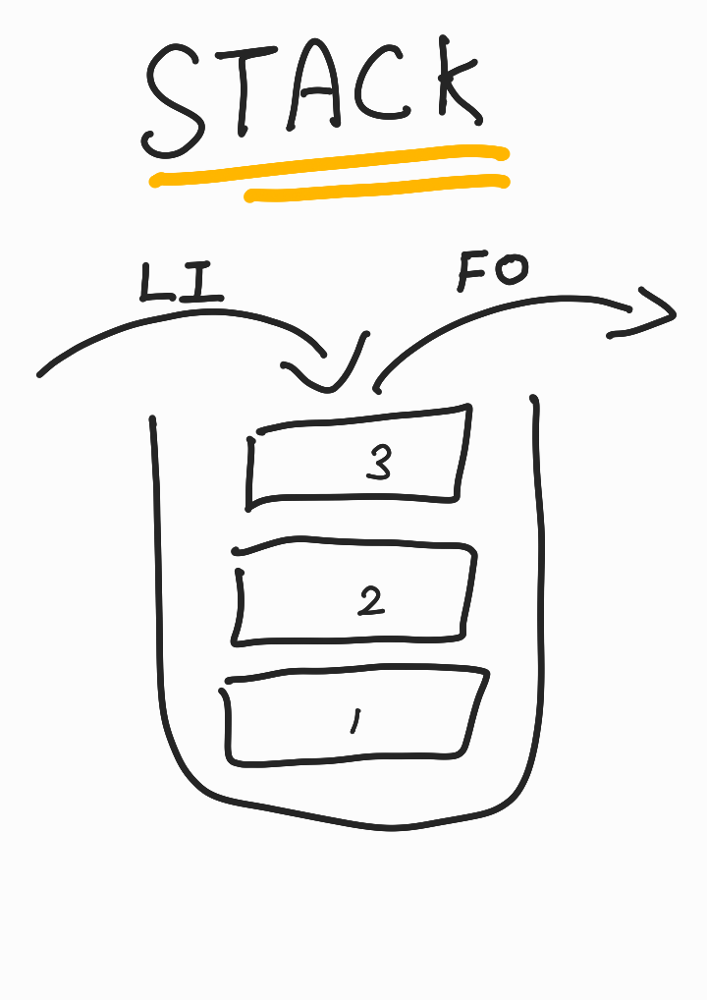

## **스택 Stack**

<div align="center">
    
</div>

### **특징**  
스택은 LIFO (Last In First Out / 후입선출) 의 특징을 가진 자료 구조다.  

위 그림과 같이 순서대로 쌓아 올려진 형태이다.   

데이터 입력은 push, 데이터 출력은 pop 이라 한다.

최근 추가된 데이터부터 순차적으로 사용되기에 ctrl Z 나 브라우저 방문 기록과 같이 최근 동작을 기억하고, 사용하는 경우에 주로 사용한다.

<br/>

<div align="center">
    
    <div>(모든 작업은 신병부터...)</div>
</div>

<br/>

---
<br/>

## **큐 Queue**

<div align="center">
    
</div>

### **특징**  
큐은 FIFO (Fist In First Out / 선입선출) 의 특징을 가진 자료 구조다.  

데이터 입력은 Enqueue, 데이터 출력은 Dequeue 라 한다. 

어떤 작업을 순서대로 실행하기 위해 대기시킬 때 (like 프린트 대기열) 사용한다.

<br/>

<div align="center">
    
    <div>(앞 작업이 정체되면 기다려야 한다...)</div>
</div>


```toc

```
